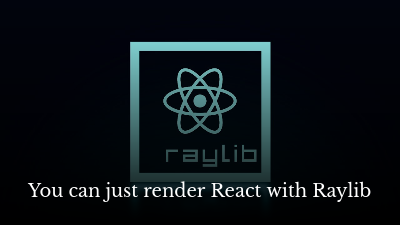

# Murayact

[MicroUI](https://github.com/rxi/microui) + [Raylib](https://www.raylib.com/) React Renderer

> [!WARNING]
> This is not a ready to use library. Just a proof of concept. But feel free to drop an Issue or a PR

## Quick Start

*Only Linux is supported right now, but feel free to add the rest of the platforms by contributing to [./packages/muray/](./packages/muray/).*

```console
$ cd ./examples/button-counter/
$ npm install
$ node native.js
```

## Screencast

This was developed on a livestream. You can watch the recording here:

[](https://www.youtube.com/watch?v=sk0VFcOeTAw)
